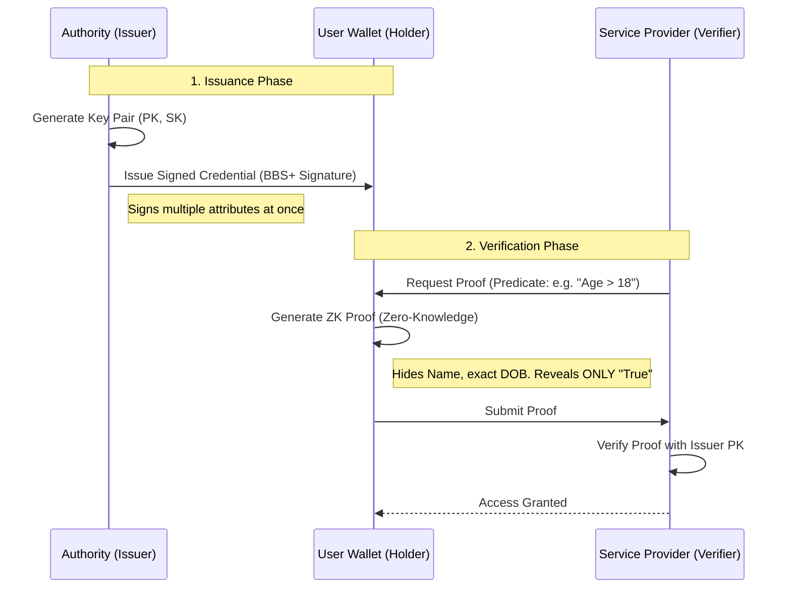

# Project Report: PrivaSeal - Universal ZKP Attribute Verification Platform

## 1. Executive Summary
**PrivaSeal** is a universal, privacy-preserving attribute verification system designed to empower users with full control over their personal data. By leveraging **Zero-Knowledge Proofs (ZKP)** and **BBS+ Signatures**, PrivaSeal allows individuals to prove specific claims (e.g., "Over 21 years old", "Government Certified Resident", "Valid Membership") without revealing their full identity, birthdate, or other sensitive personal details.

The system addresses critical gaps in the Digital Public Infrastructure (DPI) by ensuring **Unlinkability** (preventing tracking across different services) and **Selective Disclosure** (sharing only the minimum necessary data).

---

## 2. Problem Statement & Motivation
In the traditional digital identity model:
1.  **Excessive Data Exposure**: To prove age at a venue, a user must show a full ID card, revealing their home address, full name, and exact birthdate.
2.  **Correlation Risks**: If a user presents the same digital signature at a bank, a store, and a gym, these entities could theoretically collude to map the user's entire life journey.
3.  **Centralized Vulnerability**: Sensitive data stored in centralized databases remains a high-value target for security breaches.
4.  **Lack of Portability**: Users rely on siloed databases rather than carrying cryptographically verifiable claims on their own devices.

**PrivaSeal addresses these by decoupling the *Proof* from the *Data*.**

---

## 3. Solution Architecture

### 3.1 High-Level Overview
The system follows the **Verifiable Credentials (VC)** standard model:

### 3.2 Technology Stack
| Component | Technology | Role |
|-----------|------------|------|
| **Frontend** | **Next.js 14** (App Router) | Unified interface for Issuers, Holders, and Verifiers. |
| **PWA** | **next-pwa** | Offline capabilities, installable on mobile/desktop. |
| **State** | **Zustand** | Lightweight client-state management. |
| **Styling** | **TailwindCSS** + **Shadcn UI** | Accessible, responsive, and premium UI components. |
| **Backend** | **FastAPI (Python)** | High-performance async API for cryptographic operations. |
| **Database** | **SQLite** (via **SQLAlchemy**) | Stores Issuer Keys, Audit Logs, and Request Metadata. |
| **Signatures** | **BBS+ (BLS12-381)** | Allows multi-message signing and selective disclosure. |
| **Storage** | **Dexie.js (IndexedDB)** | Encrypted local storage in the browser for credentials (Self-Sovereignty). |

---

## 4. Detailed Component Analysis

### 4.1 The Issuer Portal
*   **Role**: Trusted authority (e.g., Government Agency, University, Hospital) that issues credentials.
*   **Key Features**:
    *   **Certificate Builder**: Create custom attribute sets for issuance.
    *   **Dashboard**: View issuance volume and manage organizational keys.
    *   **Secure Signing**: Uses the Authority's Private Key to sign structured data.
    *   **QR Distribution**: Generates secure QR payloads for instant wallet ingestion.

### 4.2 The User Wallet (Holder)
*   **Role**: The user agent that holds keys and credentials locally.
*   **Key Features**:
    *   **Self-Sovereign Storage**: Credentials reside *only* on the user's device, never on a central server.
    *   **Privacy Scanner**: Integrated scanner to import credentials or respond to verification requests.
    *   **ZKP Engine**: Generates randomized proofs on-the-fly based on verifier predicates.
    *   **Offline Capability**: View and present proofs without an active internet connection through logic pre-verification.

### 4.3 The Verifier Dashboard
*   **Role**: Any third party requesting proof (e.g., Bank, Event Organizer, Online Service).
*   **Key Features**:
    *   **Predicate Builder**: Define requirements (e.g., `Nationality == "IN"` OR `CreditScore > 750`).
    *   **Real-time Verification**: Instant cryptographic feedback on proof validity.
    *   **Privacy-Compliant Audit**: Logs contains only proof nonces and timestamps, ensuring no personal data is leaked to the verifier's logs.

---

## 5. Security & Privacy Analysis

### 5.1 Selective Disclosure
PrivaSeal uses **BBS+ Signatures** which sign multiple attributes individually.
*   *Scenario*: A credential contains `[Name, DOB, Passport#, Citizenship]`.
*   *Proof*: The user can reveal ONLY `Citizenship` to a service. The `Name` and `Passport#` remain hidden, yet the service can still verify the signature is valid and authentic.

### 5.2 Unlinkability
*   **The Problem**: In standard systems, using the same digital ID twice allows trackers to "link" your activities.
*   **The PrivaSeal Solution**: Each proof includes a unique random nonce. To a verifier, two proofs from the same user look like they came from two completely different people. There is zero correlation.

### 5.3 Threat Model & Mitigations
| Threat | Mitigation |
|--------|------------|
| **Server Breach** | Minimal data storage. No private keys or PII reside on the central server. |
| **Replay Attack** | Proofs are cryptographically bound to a unique request ID and timestamp. |
| **Identity Theft** | Wallet-side biometric protection and encrypted IndexedDB storage. |

---

## 6. API Specification (Universal Endpoints)

### Issuer API
*   `POST /api/issuer/init` - Initialize an issuing authority.
*   `POST /api/issuer/issue` - Issue a new attribute-bundle (signs data).
*   `GET /api/issuer/stats` - Monitor issuance metrics.

### Verifier API
*   `POST /api/verifier/request` - Define a verification predicate.
*   `POST /api/verifier/verify` - Submit and validate a ZK Proof.
*   `GET /api/verifier/{id}/audit` - Access privacy-safe verification history.

---

## 7. Universal Use-Cases

### Use-Case 1: Age Verification
*   **Issuer**: DMV / Driving License Authority.
*   **Credential**: `[DOB: 2000-01-01, Name: Jane Doe]`.
*   **Proof**: "Age > 18" (Reveals: True. Hides: Birthday, Name, Home Address).

### Use-Case 2: Employment Verification
*   **Issuer**: Corporate HR Department.
*   **Credential**: `[EmployeeID, Title, Salary, Tenure]`.
*   **Proof**: "Salary > $50,000" (Reveals: True. Hides: Exact salary, Employee ID).

---

## 8. Development Roadmap
1.  **WASM Cryptographic Core**: Moving from Python/JS mock layers to high-performance Rust/WASM for production-grade speed.
2.  **Decentralized Identifiers (DIDs)**: Leveraging blockchain anchors to make Issuer Public Keys verifiable globally without a central registry.
3.  **Cross-Platform Sync**: Encrypted, end-to-end backup solutions for credentials recovery.
